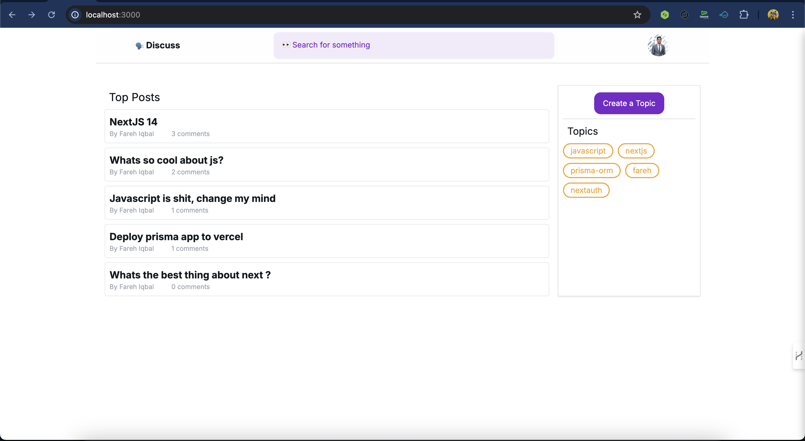
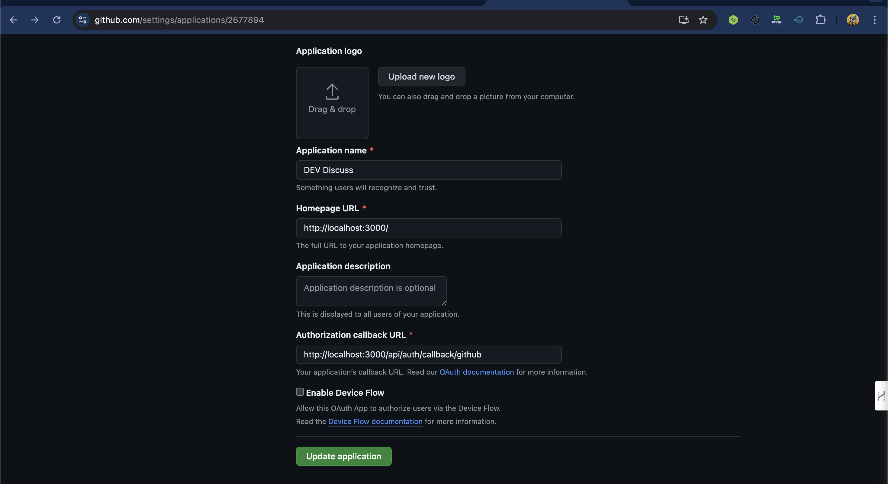

# Project Name

A simple Reddit like app built with Next.js, TypeScript, Prisma & NextUI. Authntication is done with GitHub using NextAuth.js.




## Prerequisites

Before you begin, ensure you have met the following requirements:

- **Node.js** (v14 or later) installed on your machine.
- **npm** (Node Package Manager) or **yarn** installed.
- A code editor such as **Visual Studio Code**.
- A GitHub account for setting up OAuth credentials.

## Getting Started

To get your project up and running, follow these steps:

## Clone the Repository

Clone this repository to your local machine using the following command:

```bash
git clone https://github.com/farehiqbal/discuss-app.git

cd discuss-app
```

## Install Dependencies

Next, install the project dependencies:

```bash
npm install
```

## Set Up Environment Variables

 *** You will need to create a GitHub OAuth app to get the `GITHUB_ID` and `GITHUB_SECRET` values. ***

- Go to [GitHub Developer Settings](

- Click on "New OAuth App".
- Fill in the form with the following details:
  - Application name: Discuss App
  - Homepage URL: http://localhost:3000
  - Authorization callback URL: http://localhost:3000/api/auth/callback/github
- Click on "Register application".
- Copy the `Client ID` and `Client Secret` values.




Create a `.env.local` file in the root of the project and add the following environment variables:

```bash
DATABASE_URL="DATABASE_URL="file:./dev.db"

```
Then, create a .env.local file in the root of the project and add the following environment variables:

```bash
GITHUB_ID=YOUR_GITHUB_CLIENT_ID
GITHUB_SECRET=YOUR_GITHUB_CLIENT_SECRET
AUTH_SECRET=SomethingSecret
```

## Run Migrations 
```bash
npx prisma migrate dev
```

## Start the Development Server

Finally, start the development server:

```bash
npm run dev
```

Open [http://localhost:3000](http://localhost:3000) in your browser to see the app running.

Please note that if you aren't able to do authentication with GitHub at this point, you may have made a mistake in setting up the environmental variables. Double-check the `Homepage URL` and `Authorization callback URL` values in your GitHub OAuth app settings.

## Built With

- Next.js
- TypeScript
- Prisma
- NextUI
- NextAuth.js
- SQLite
- Tailwind CSS

## License

This project is licensed under the MIT License - see the [LICENSE](LICENSE) file for details.

## Acknowledgements

- [Next.js](https://nextjs.org/)
- [Prisma](https://www.prisma.io/)
- [NextUI](https://nextui.org/)
- [NextAuth.js](https://next-auth.js.org/)
- [Tailwind CSS](https://tailwindcss.com/)


